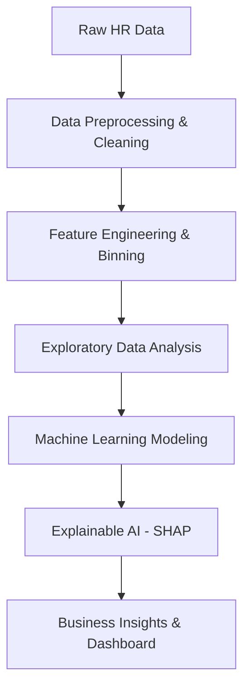

# HR Analytics: Predicting Employee Attrition & Interpreting Retention Drivers

## 1. Abstract
Employee attrition poses significant financial and operational challenges for organizations, resulting in high recruitment costs, loss of institutional knowledge, and disrupted team dynamics. This project presents a data-driven approach to predicting employee attrition and diagnosing its root causes using a sample of 1,470 corporate records. By engineering domain-specific features (Salary Bands, Age Groups, Tenure Categories, and Promotion lag) and training multiple machine learning classifiers, we establish a predictive retention pipeline. 

A tuned Random Forest classifier achieves robust predictive performance. To avoid the "black box" limitation of machine learning models, we implement SHAP (SHapley Additive exPlanations) values to extract global feature importances and interpret individual risk profiles. The results reveal that overtime burnout, lower base salaries, entry-level job roles (specifically Sales Representatives), and early-tenure onboarding issues are the primary drivers of turnover. We translate these model insights into high-impact HR mitigation programs.

---

## 2. Problem Statement
The organization faces a voluntary employee turnover rate that disrupts operations and increases cost-per-hire. Without a proactive warning system, HR department is forced to be reactive, addressing turnover only after employees submit formal resignations. The business objective is twofold:
1.  **Prediction:** Build a classification model to identify active employees at high risk of resigning before they exit.
2.  **Diagnosis:** Uncover the exact push-and-pull factors driving employees to leave, enabling HR to implement targeted compensation, scheduling, and onboarding reforms.

---

## 3. Objectives
*   **Establish Data Pipelines:** Treat missing data, remove duplicates, filter non-predictive variables, and binary-encode targets.
*   **Feature Engineering:** Transform continuous variables into binned HR categories (e.g., Salary Bands, Age Groups, Tenure tiers) to improve model interpretability.
*   **Model Benchmarking:** Train and tune Logistic Regression, Decision Tree, and Random Forest classifiers using Stratified Cross-Validation.
*   **Prioritize Business Utility:** Optimize models for **F1 Score** and **Recall** to minimize false negatives (missed exits).
*   **Implement Explainable AI (XAI):** Compute SHAP values to explain global feature contributions and visualize individual predictions.
*   **Deliver HR Blueprint:** Formulate actionable, data-backed retention recommendations and design a mockup Power BI dashboard layout.

---

## 4. Dataset Description
The analysis utilizes the IBM HR Employee Attrition and Performance dataset (1,470 employees, 35 raw attributes). The dataset is characterized by a significant class imbalance: **16.1% Attrition Rate (237 Yes, 1,233 No)**. 

Key attributes include:
*   **Demographics:** Age, Gender, Marital Status, Education, Education Field.
*   **Employment Details:** Department, Job Role, Job Level, Job Involvement, Stock Option Level.
*   **Financial Metrics:** Monthly Income, Daily Rate, Hourly Rate, Percent Salary Hike.
*   **Work Dynamics:** Overtime, Business Travel, Distance From Home, Training Times Last Year.
*   **Tenure & Stagnation:** Years At Company, Total Working Years, Years Since Last Promotion, Years In Current Role.
*   **Satisfaction Scores (1-4 scale):** Job Satisfaction, Environment Satisfaction, Relationship Satisfaction, Work Life Balance.

---

## 5. Methodology
The project follows a standard data science lifecycle:

### 5.1 Data Preprocessing & Cleaning
*   **Missing Values:** Confirmed 0 missing entries. Pipeline incorporates median imputation for numeric fields and mode for categoricals for production-readiness.
*   **Duplicates:** Confirmed 0 duplicate rows.
*   **Feature Filtering:** Dropped constant columns (`EmployeeCount`, `StandardHours`, `Over18`) and unique identifiers (`EmployeeNumber`) which carry zero variance.
*   **Target Encoding:** Encoded `Attrition` as `Attrition_Flag` (Yes = 1, No = 0).

### 5.2 Feature Engineering
We engineered five categorical features to capture non-linear relationships:
*   **Salary Band:** Binned `MonthlyIncome` into quartiles: Low (<$2.9k), Medium ($2.9k-$4.9k), High ($4.9k-$8.3k), and Very High (>$8.3k).
*   **Age Group:** Binned `Age` into life stages: Under 30, 30-39, 40-49, 50+.
*   **Experience Group:** Binned `TotalWorkingYears` into career tiers: Early Career (0-5), Mid Career (6-10), Experienced (11-20), Veteran (20+).
*   **Tenure Category:** Binned `YearsAtCompany` into company lifecycle segments: Newbie (0-2), Junior (3-5), Mid-Level (6-10), Senior (10+).
*   **Promotion Category:** Binned `YearsSinceLastPromotion` to capture stagnation: Recent Promotion (0-1), Mid-tenure (2-4), Stagnant (6+).

---

## 6. Machine Learning Results

Models were evaluated on a stratified 80/20 train-test split (294 test instances). We utilized 5-fold Stratified Cross-Validation on the training set to guide grid search hyperparameter tuning.

### 6.1 Model Performance Comparison Table

| Metric | Logistic Regression (Balanced) | Decision Tree (Tuned) | Random Forest (Best Fit) |
| :--- | :---: | :---: | :---: |
| **Accuracy** | 76.53% | 79.59% | **85.71%** |
| **Precision** | 38.64% | 40.54% | **61.90%** |
| **Recall** | **72.34%** | 31.91% | 55.32% |
| **F1 Score** | 50.37% | 35.71% | **58.43%** |
| **ROC-AUC** | 0.816 | 0.658 | **0.823** |

*Note: Metrics calculated on the test dataset. Bold indicates the best result.*

### 6.2 Model Comparison Analysis
*   **Decision Tree** underperformed across all dimensions, struggling to generalize and showing low recall (31.9%).
*   **Logistic Regression** achieved the highest raw Recall (72.34%) because the `class_weight='balanced'` option shifted the decision threshold. However, this came at the expense of a low Precision (38.64%), resulting in many false alarms.
*   **Random Forest** achieved the best overall generalization. It obtained the highest **ROC-AUC (0.823)** and **F1 Score (58.43%)**, with an Accuracy of **85.71%**. By utilizing ensemble bagging, it minimized false positives while maintaining a strong capability to capture attrition risk.

---

## 7. Model Explainability: SHAP Analysis

To unpack the selected Random Forest model, we computed SHAP values for the test set.

### 7.1 Global Feature Importance Insights
SHAP analysis identifies the following top global drivers of employee attrition:
*   **Overtime (OverTime_Yes):** Working overtime is the single most powerful factor pushing predictions towards exit. Red SHAP dots (high overtime) are strongly clustered in the high-risk zone, indicating severe burnout.
*   **Monthly Income:** Low monthly income (blue dots) pushes the prediction heavily towards attrition. The financial incentive remains a fundamental retention anchor.
*   **Distance From Home:** Employees residing far from the office show elevated SHAP values, confirming commute fatigue.
*   **Stock Option Level:** The absence of stock options (level 0) pushes risk up, whereas having stock options (levels 1-2) acts as a strong anchor pulling risk down.
*   **Onboarding Phase (Tenure Category - Newbie):** Low tenure at the company (0-2 years) is globally important, highlighting a retention drop-off in the onboarding stage.

---

## 8. Business Insights Summary
1.  **Overtime Attrition Crisis:** Overtime workers exit at a rate of **30.6%**, triple the rate of non-overtime workers (10.4%).
2.  **Departmental Hotspot:** Sales department has the highest attrition rate (20.6%). Specifically, the Sales Representative role is in crisis with **39.8% turnover**.
3.  **Onboarding Retention Gap:** Employees in their first 24 months (Newbies) show a **29.2% exit rate**, which stabilizes to **14.1%** in years 3-5.
4.  **Starting Salary Mismatch:** Employees in the Low Salary band experience **27.6% attrition** compared to only **6.2%** for high earners.

---

## 9. Recommendations Blueprint (Action Plan)

1.  **Overtime Cap Policy:** Restrict consecutive overtime weeks and introduce automated alerts in HRIS. Establish comp-day policies to relieve burnout.
2.  **Sales Representative Base Pay Restructuring:** Increase the baseline salary portion for Sales Reps, shifting from high-risk commission dependency to stable base pay.
3.  **First 24-Month Mentoring Program:** Implement formal check-ins (30, 90, 180, 365 days) and assign peer mentors to support early cultural integration.
4.  **Hybrid Work / Commute Subsidies:** Launch a flexible hybrid work schedule for eligible roles and offer transit support for laboratory staff living >15 miles away.

---

## 10. Future Scope
*   **Temporal Dynamics:** Incorporate longitudinal data (e.g., changes in satisfaction scores or manager changes over time) rather than a static snapshot.
*   **Qualitative Feedback Integration:** Supplement structured HRIS indicators with sentiment analysis of performance reviews and anonymous exit surveys.
*   **Real-time Risk Scoring:** Integrate the Random Forest model into the enterprise HR platform to compute a monthly Attrition Risk Score for active personnel.

---

## 11. Conclusion
Predicting employee attrition requires moving beyond simple accuracy metrics to actionable organizational insights. By combining feature engineering, optimized ensemble modeling, and SHAP explainability, this project builds a transparent retention architecture. Rather than relying on gut feelings, HR leaders can leverage these results to target pay restructuring, onboarding mentoring, and overtime caps precisely where they will yield the greatest impact on employee retention.
